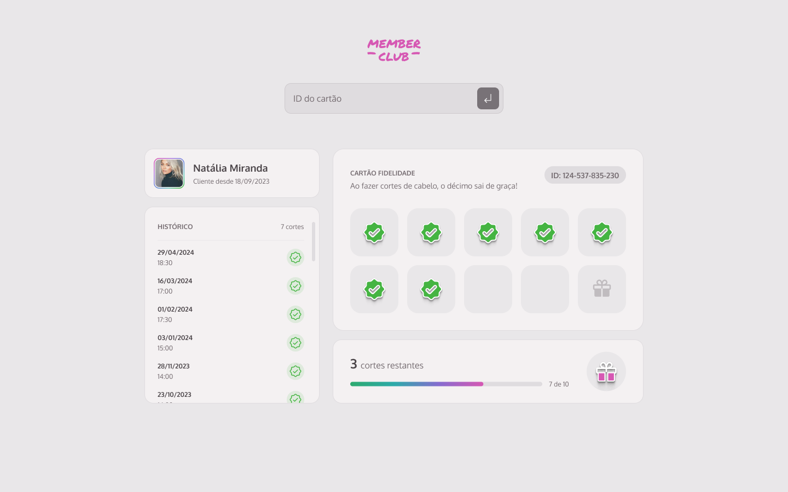

# MEMBER CLUB

Desafio pratico do módulo de fundamentos do desenvolvimento WEB

## Conceitos que serão praticados aqui:
- HTML
- Estilização com CSS
- Lógica de programação
- Conhecimentos básicos de JavaScript
- Responsividade

Acesse o figma [aqui.](https://www.figma.com/design/3ooLHBlY4RTv1XEluv4XXE/Cart%C3%A3o-fidelidade--Community---Copy-?node-id=3-376&p=f&t=1xcVuwt470Dtl5sv-0)

## Critérios de aceite

- [x] Deve ser possível buscar um cliente digitando o ID na busca e apertando a tecla Enter;
- [ ] Deve haver uma validação pra saber se é um ID válido e existente;
- [x] Deve aparecer um alerta de erro em tela caso seja um ID inválido;

### Tendo sucesso em trazer os dados de cada cliente:

- [ ] Deve ser exibida na tela a imagem do(a) cliente;
- [ ] Deve ser exibido na tela o nome do(a) cliente;
- [ ] Deve ser exibido na tela o histórico de cortes com a quantidade, a data e a hora;
- [ ] Deve ter um check no cartão fidelidade para cada corte de cabelo que o(a) cliente tiver;
- [ ] Deve ser exibido na tela um progresso com o número de cortes restantes para o prêmio;
- [ ] Deve aparecer na tela um modal de parabéns com a mensagem: “Parabéns! Seu próximo corte é gratuito!” caso o cliente tenha atingido os 10 cortes;

